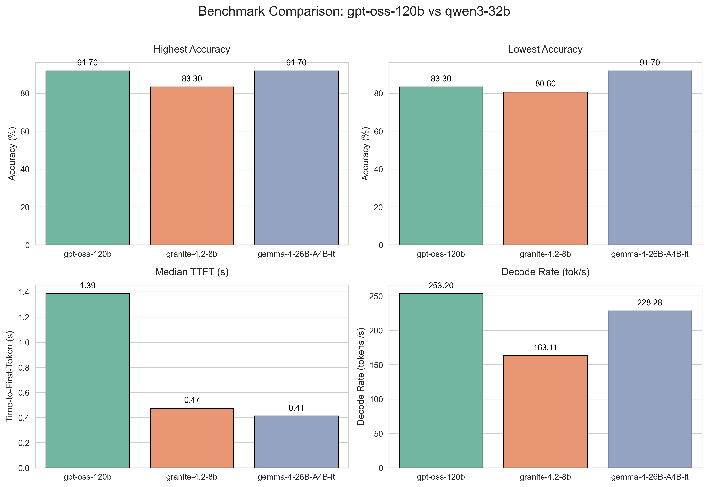

# Open WebUI Model Benchmark
This repository contains an automated evaluation suite designed to benchmark local Large Language Models (LLMs) served via Open WebUI. The framework aims to evaluate model performance to find the smallest and fastest model that maintains high accuracy.

## How to Run

1. Create a file called `secrets.txt` in the root folder where the benchmark script is located.
2. Add your credentials inside using this format:

```text
API_KEY = "your_openai_api_key_here"
BASE_URL = "https://your-endpoint-url-here/api"
```
## General Performance Results



## Methodology

The script runs a suite of 36 automated tasks to evaluate how well each model:
*   **Follows strict instructions:** Such as avoiding forbidden words or formatting output strictly as JSON.
*   **Recalls domain facts:** Answering specific questions about enterprise AI and hardware.
*   **Writes code and solves math:** Generating Python scripts and calculating precision/recall metrics.
*   **Synthesizes context (RAG):** Finding specific information hidden inside provided text while refusing to answer ungrounded questions.

## How to Interpret the Metrics

*   **Curriculum Accuracy:** How many of the 36 tests the model passed correctly. A higher percentage indicates better reasoning and strict instruction adherence.
*   **Median TTFT (Time To First Token):** How long it takes the model to "think" before it starts typing. A lower number means the model reacts faster to your prompt.
*   **Aggregate Decode Rate (tok/s):** The actual typing speed of the model. To get a realistic number, the script divides the total words (tokens) generated by the total generation time, ignoring tiny, bursty answers that usually skew the results.

> *Note: Reported metrics reflect the best of three independent benchmark runs per model.*


## Methodological Decisions
* **Burst Suppression Filter:** Very short responses (< 15 tokens or < 0.1s) often arrive from web proxies in a single network packet, producing artificially inflated generation rates ($> 1000\text{ tok/s}$). These bursts are automatically excluded from the decode rate calculation to preserve hardware accuracy.
* **Limited Sample Size:** The sample size (N=20) is intentionally kept small to allow a quick comparison of models. 

## Disclaimer
The benchmark prompts and validation criteria were generated by a frontier cloud model, then curated and verified by human review. 

## RAG Test Results
We observed that calculation tests were passed only after activating the thinking option in all LLMs. Both gemma4 and gpt-oss models passed all 4 of RAG tests and the smallest model (qwen4.2-8b) passed 3/4 of all tests. The console outputs can be viewed in the console output.


## Future Models to be Explored
* google/gemma-4-26B-A4B-it
* ornith-ai/Ornith-1.5-9B
* Qwen/Qwen3.8-27B (optional)

<details>
<summary><b>Click to expand raw benchmark execution logs</b></summary>

```console

Starting Performance Benchmark for: openai/gpt-oss-120b

[01/4] Least Expensive Product              | PASS | TTFT: 1.118s | [Short Burst: 148 tok]
[02/4] Most Expensive Product               | PASS | TTFT: 0.775s | [Short Burst: 147 tok]
[03/4] Most Sold Product                    | PASS | TTFT: 7.524s | 1659.02 tok/s (1741 tok)
[04/4] First Product Sold                   | PASS | TTFT: 0.689s | [Short Burst: 129 tok]

=======================================================
 BENCHMARK & RAG EVALUATION SUMMARY
=======================================================
Total Tests Run: 4
Tests Passed:    4 (100.0%)
Average TTFT:    2.527s
Average TPS:     1659.02 tokens/s

Detailed evaluation logs saved to: RAG_eval_results.csv

--- SALES LEADERBOARD ---
[P006] Bike Lights         : 61 units sold
[P004] Gloves              : 50 units sold
[P007] Bike Lock           : 41 units sold
[P008] Bike Rack           : 39 units sold
[P003] Helmet              : 38 units sold
[P005] Water Bottle        : 33 units sold
[P001] Mountain Bike       : 18 units sold
[P002] Road Bike           : 15 units sold
-----------------------------------
 WINNER: Bike Lights (P006) with 61 total sales

 Starting Performance Benchmark for: ibm-granite/granite-4.2-8b

[01/4] Least Expensive Product              | PASS | TTFT: 0.803s | 171.72 tok/s (602 tok)
[02/4] Most Expensive Product               | PASS | TTFT: 0.450s | 175.99 tok/s (491 tok)
[03/4] Most Sold Product                    | FAIL | TTFT: 0.449s | 157.57 tok/s (2500 tok)
[04/4] First Product Sold                   | PASS | TTFT: 0.454s | 170.64 tok/s (643 tok)

=======================================================
 BENCHMARK & RAG EVALUATION SUMMARY
=======================================================
Total Tests Run: 4
Tests Passed:    3 (75.0%)
Average TTFT:    0.539s
Average TPS:     168.98 tokens/s

Detailed evaluation logs saved to: RAG_eval_results.csv

--- SALES LEADERBOARD ---
[P006] Bike Lights         : 61 units sold
[P004] Gloves              : 50 units sold
[P007] Bike Lock           : 41 units sold
[P008] Bike Rack           : 39 units sold
[P003] Helmet              : 38 units sold
[P005] Water Bottle        : 33 units sold
[P001] Mountain Bike       : 18 units sold
[P002] Road Bike           : 15 units sold
-----------------------------------
 WINNER: Bike Lights (P006) with 61 total sales

 Starting Performance Benchmark for: google/gemma-4-26B-A4B-it

[01/4] Least Expensive Product              | PASS | TTFT: 2.339s | [Short Burst: 364 tok]
[02/4] Most Expensive Product               | PASS | TTFT: 1.968s | [Short Burst: 384 tok]
[03/4] Most Sold Product                    | PASS | TTFT: 12.523s | [Short Burst: 2500 tok]
[04/4] First Product Sold                   | PASS | TTFT: 2.381s | [Short Burst: 467 tok]

=======================================================
 BENCHMARK & RAG EVALUATION SUMMARY
=======================================================
Total Tests Run: 4
Tests Passed:    4 (100.0%)
Average TTFT:    4.803s

Detailed evaluation logs saved to: RAG_eval_results.csv

--- SALES LEADERBOARD ---
[P006] Bike Lights         : 61 units sold
[P004] Gloves              : 50 units sold
[P007] Bike Lock           : 41 units sold
[P008] Bike Rack           : 39 units sold
[P003] Helmet              : 38 units sold
[P005] Water Bottle        : 33 units sold
[P001] Mountain Bike       : 18 units sold
[P002] Road Bike           : 15 units sold
-----------------------------------
 WINNER: Bike Lights (P006) with 61 total sales
